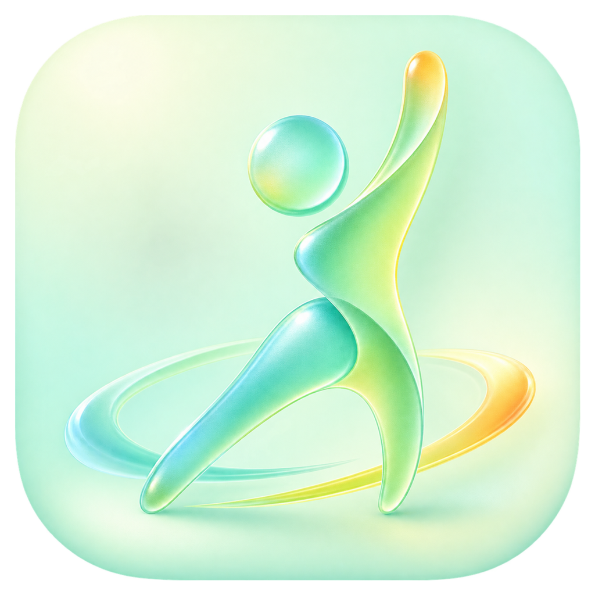

# 居家运动

面向低冲击有氧与基础力量训练的 Android 计时 App。使用 Android 系统
Text-to-Speech 提供免费中文语音播报，不依赖付费语音服务。

<p align="center">
  
</p>

## 功能

- 训练进行中每秒保存进度，退出或进程终止后可继续
- 切到后台或锁屏后继续倒计时，并通过常驻通知控制暂停、继续和结束
- 自动记录每天自然完成的动作、组数、次数和运动时长
- 月历打卡视图，可切换月份并查看每天明细
- 免费中文系统 TTS，播报动作、组数、休息和倒计时
- 暖色、圆润、轻游戏感的原生 Android UI

## 训练内容

- 低冲击开合跳：20 组，每组 60 秒
- 靠墙静蹲：3 组，每组 30 秒
- 深蹲：3 组，每组 12 次
- 跪姿俯卧撑：3 组，每组 10 次
- 平板支撑：3 组，每组 25 秒
- 每段之间休息 30 秒

支持动作介绍、组数与休息进度、暂停、继续和跳过。跳过的动作不会计入打卡记录。

## 安装

从 GitHub Releases 下载最新 APK。最低支持 Android 8.0（API 26）。设备需安装中文
TTS 语音数据。

## 构建

```bash
./gradlew assembleDebug
```

## Logo

当前 Logo 图片由项目所有者提供，详见 [Logo 说明](branding/LOGO-NOTICE.md)。
