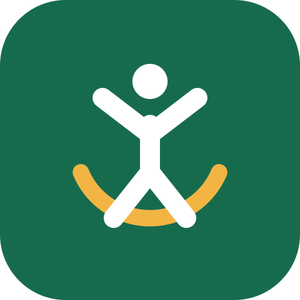

# 居家运动

面向低冲击有氧与基础力量训练的 Android 计时 App。使用 Android 系统
Text-to-Speech 提供免费中文语音播报，不依赖付费语音服务。



## 训练内容

- 低冲击开合跳：20 组，每组 60 秒
- 靠墙静蹲：3 组，每组 30 秒
- 深蹲：3 组，每组 12 次
- 跪姿俯卧撑：3 组，每组 10 次
- 平板支撑：3 组，每组 25 秒
- 每段之间休息 30 秒

支持动作介绍、组数与休息进度、倒计时语音、暂停、继续、跳过和训练进度恢复。

## 安装

从 GitHub Releases 下载最新 APK。最低支持 Android 8.0（API 26）。设备需安装中文
TTS 语音数据。

## 构建

```bash
./gradlew assembleDebug
```

## Logo

`branding/home-sport-logo.svg` 及对应 Android launcher icon 是本项目原创素材，按
[CC0 1.0 Universal](branding/LOGO-LICENSE.md) 释放，可自由商用、修改与再分发。
